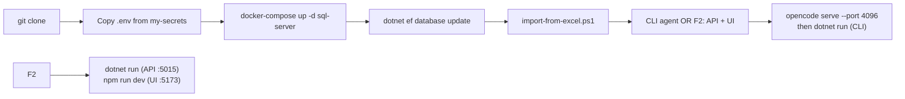
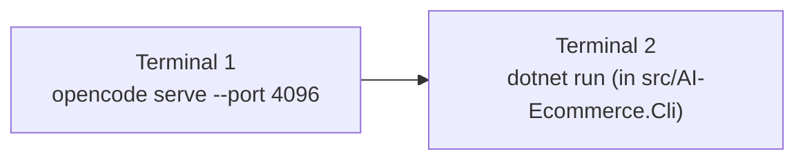
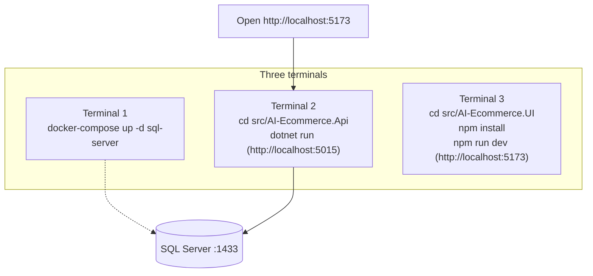

# How to Run This Project

End-to-end guide: from `git clone` to a fully running stack (SQL Server +
API + CLI + React UI), including where secrets come from and how to push/pull
with the exact ordering this repo expects.



---

## 1. Prerequisites

- [.NET SDK](https://dotnet.microsoft.com/download) 8.0+ — SDK 10.x is fine;
  all projects target `net8.0`
- [Docker Desktop](https://www.docker.com/products/docker-desktop/) for SQL
  Server via `docker-compose`
- [Node.js](https://nodejs.org/) 18+ and npm (React UI)
- [Git](https://git-scm.com/)
- `dotnet-ef` tool for migrations:
  ```bash
  dotnet tool install --global dotnet-ef
  ```
- `opencode` CLI (for the **default** CLI chat provider):
  ```bash
  npm install -g opencode-ai   # or your preferred install method
  ```

---

## 2. Clone the project

```bash
git clone https://github.com/bhakti857/AgenticCommercePlatform.git
cd AgenticCommercePlatform
```

---

## 3. Get the `.env` secrets

`.env` is **never committed** (git-ignored). It lives in the private
`my-secrets` repo:

```bash
git clone https://github.com/bhakti857/my-secrets.git
```

Then copy the project's `.env` into the solution root (same folder as
`AI-Ecommerce-Platform.slnx`):

```bash
# Windows PowerShell
Copy-Item ..\my-secrets\AgenticCommercePlatform\.env .\.env

# macOS / Linux
cp ../my-secrets/AgenticCommercePlatform/.env ./.env
```

No access to `my-secrets`? Copy the template and fill in real values:

```bash
Copy-Item .env.example .env
```

`.env` must contain all of these keys:

```
DEEPSEEK_API_KEY=
GITHUB_TOKEN=
GROQ_API_KEY=
OPENROUTER_API_KEY=
CONNECTION_STRING=Server=localhost,1433;Database=AgenticCommerceDB;User Id=sa;Password=YourStrong!Passw0rd;TrustServerCertificate=True;

# CLI chat provider: "opencode" (default) or "openrouter"
LLM_PROVIDER=opencode
# optional opencode server settings (used only by the CLI's opencode provider)
OPENCODE_URL=http://127.0.0.1:4096
OPENCODE_SERVER_PASSWORD=
# optional: override the API's chat model (default is openai/gpt-oss-20b)
GROQ_MODEL=openai/gpt-oss-20b

# signing key for JWTs (32+ chars; never reuse across environments)
JWT_SECRET=
```

What each key does:

| Key | Used by | Purpose |
|---|---|---|
| `GROQ_API_KEY` | Web API | LLM for `/api/agent/chat` (falls back to a mock client if unset) |
| `GROQ_MODEL` | Web API | Chat model on Groq (default `openai/gpt-oss-20b`) |
| `OPENROUTER_API_KEY` | CLI (`LLM_PROVIDER=openrouter`) | LLM for the CLI's OpenRouter path |
| `CONNECTION_STRING` | CLI, `dotnet ef` | SQL Server connection — keep in sync with `appsettings.json` |
| `JWT_SECRET` | Web API | Signs JWTs; must be 32+ random chars |
| `LLM_PROVIDER` | CLI | `opencode` (default) or `openrouter` |
| `OPENCODE_URL` / `OPENCODE_SERVER_PASSWORD` | CLI | Where/how to reach the opencode server |
| `DEEPSEEK_API_KEY` / `GITHUB_TOKEN` | — | Reserved/legacy, currently unused |

Generate `JWT_SECRET`:

```powershell
[Convert]::ToBase64String((1..48 | ForEach-Object { Get-Random -Maximum 256 }))
```

> ⚠️ Never commit `.env`. Update secrets in `my-secrets` and re-copy locally.

> ⚠️ The Web API reads `ConnectionStrings:DefaultConnection` from
> `appsettings.json`, *not* from `.env`. Keep both pointing at the same SQL
> Server, or the API and CLI will use **two different databases**.

---

## 4. Start the database

```bash
docker-compose up -d sql-server
```

SQL Server 2022 on port `1433` (user `sa`, password `YourStrong!Passw0rd` —
matches `CONNECTION_STRING`). `adminer` (web DB browser at
`http://localhost:8080`) is available via:

```bash
docker-compose up -d adminer
```

---

## 5. Apply migrations and import seed data

### 5a. Create the schema

```bash
cd src/AI-Ecommerce.Data
dotnet ef database update --startup-project ..\AI-Ecommerce.Cli
cd ..\..
```

Creates the `AgenticCommerceDB` tables. Migrations also seed `DepartmentMaster`
and `UserTypeMaster` via EF Core `HasData`. No other data is inserted here.

### 5b. Import seed data from Excel

All reference data lives in `schema/data.xlsx`. Import it:

```powershell
$env:SQL_SA_PASSWORD = 'YourStrong!Passw0rd'
.\scripts\import-from-excel.ps1
```

Populates every table: customers, employees, departments, categories,
products, warehouses, stock, etc. The API prints a warning at startup listing
any tables that are still empty (i.e. you skipped this step).

### 5c. Update seed data

1. Edit the relevant worksheet in `schema/data.xlsx` (one sheet per table).
2. Re-run `.\scripts\import-from-excel.ps1`.

To export the live database **back** to files (after app-driven changes) and
commit them:

```powershell
$env:SQL_SA_PASSWORD = 'YourStrong!Passw0rd'
.\scripts\export-data.ps1
```

Regenerates: `schema/data.xlsx`, `schema/schema.txt`, `scripts/seed-data.sql`.

---

## 6. Run the project

Pick one of the three options below.

### Option A — CLI agent (fastest; default provider = opencode)



```bash
# Terminal 1 — start the opencode server the CLI talks to
opencode serve --port 4096

# Terminal 2 — the CLI agent
cd src/AI-Ecommerce.Cli
dotnet run
```

- Type messages at the `🤖 >` prompt; `exit` to quit.
- Chat history resumes across restarts (the session id is stored in
  `.opencode-session` next to the output assembly — delete it for a fresh chat).
- No key needed for this path; your opencode setup handles the model.
- Prefer OpenRouter instead? Set `LLM_PROVIDER=openrouter` in `.env`
  (uses `OPENROUTER_API_KEY`, falls back to the mock client if unset, and
  prompts `y/n` before each write/command).

### Option B — Full web stack (API + React UI)



```bash
# Terminal 1 — database (background, once)
docker-compose up -d sql-server

# Terminal 2 — Web API (must stay running, http://localhost:5015, Swagger at /swagger)
cd src/AI-Ecommerce.Api
dotnet run

# Terminal 3 — React UI (must stay running, http://localhost:5173)
cd src/AI-Ecommerce.UI
npm install
npm run dev
```

Then, in the browser:

1. Login with an existing **employee** account, or self-register a **customer**
   account and log in.
2. **Customers** can browse products, use the cart, checkout (COD/UPI), track
   orders, and edit their profile.
3. **Employees** also get the Dashboard and Master Data CRUD pages.
4. `/agent` chat is **employees only** — customers receive `403`. The agent's
   write/execute tools are available only to MasterAdmin/Admin, and each one
   waits for approval via `POST /api/agent/approvals/{token}` (pending items:
   `GET /api/agent/approvals`). Create staff accounts via `/employeeregister`
   (requires a MasterAdmin/Admin login) or
   `POST /api/auth/register-employee`.
5. The API uses `GROQ_API_KEY` + `GROQ_MODEL` (falls back to a mock client if
   unset — the console prints `using mock client`).

### Option C — Everything via Docker Compose

```bash
docker-compose up -d --build
```

Brings up `sql-server`, `api` (ports `5000:80` / `5001:443`), and `adminer`
(`:8080`). Note: the browser UI still targets `http://localhost:5015/api`, so
run the API with `dotnet run` (Option B) when using the UI, or point
`src/AI-Ecommerce.UI/src/api/client.ts` at the compose API port instead.

---

## 7. Build / test from the command line

From the solution root, the `.slnx` must be targeted explicitly (multiple
project files exist, so bare `dotnet build` fails with `MSB1011`):

```bash
dotnet build AI-Ecommerce-Platform.slnx
dotnet test  AI-Ecommerce-Platform.slnx
```

---

## 8. Git workflow — pushing and pulling

Feature-branch + PR against `main`. **All seed data lives in
`schema/data.xlsx`** — migrations create schema only, never data.

### After pulling — update the database

```bash
git pull origin main

cd src/AI-Ecommerce.Data
dotnet ef database update --startup-project ..\AI-Ecommerce.Cli
cd ..\..

$env:SQL_SA_PASSWORD = 'YourStrong!Passw0rd'
.\scripts\import-from-excel.ps1
```

If you added new entity changes in the pulled code, run
`dotnet ef migrations add <Name> --startup-project ..\AI-Ecommerce.Cli`
*before* `database update`.

### Before pushing — export the database to files

If the app changed data (new products, updated records, etc.), regenerate the
committed files from the live DB **before** committing:

```powershell
$env:SQL_SA_PASSWORD = 'YourStrong!Passw0rd'
.\scripts\export-data.ps1
```

| File | Contents |
|------|----------|
| `schema/data.xlsx` | All table records (one worksheet per table) |
| `schema/schema.txt` | CREATE TABLE DDL for every table |
| `scripts/seed-data.sql` | T-SQL script to restore all records |

```bash
git add schema/data.xlsx schema/schema.txt scripts/seed-data.sql
git commit -m "Update schema/data exports from live DB"
```

### Making and pushing a change

```bash
git checkout -b your-feature-name

# change code…

# if you changed EF entities, add a migration
cd src/AI-Ecommerce.Data
dotnet ef migrations add <DescriptiveName> --startup-project ..\AI-Ecommerce.Cli
dotnet ef database update --startup-project ..\AI-Ecommerce.Cli
cd ..\..

# export schema/data, then build
$env:SQL_SA_PASSWORD = 'YourStrong!Passw0rd'
.\scripts\export-data.ps1
dotnet build AI-Ecommerce-Platform.slnx

git add .
git commit -m "Describe what you changed and why"
git push origin your-feature-name
```

Open a PR targeting `main` and merge once reviewed. Solo small changes can go
straight to `main`, but always export + build first.

### Before every push — sanity checklist

- [ ] `.env` is **not** staged (`git status` never shows it)
- [ ] `.\scripts\export-data.ps1` ran (schema + data files updated)
- [ ] `dotnet build AI-Ecommerce-Platform.slnx` succeeds
- [ ] New/changed entity ⇒ matching EF migration
- [ ] Secrets/API keys only in `.env` (or `my-secrets`) — never in
      `appsettings.json`, source, or commits

---

## 9. Troubleshooting

| Symptom | Fix |
|---|---|
| `dotnet build` → `MSB1011` | Run `dotnet build AI-Ecommerce-Platform.slnx` (target the `.slnx` explicitly) |
| API exits: `Jwt:Secret is missing or too short` | `.env` needs a `JWT_SECRET` of 32+ chars — see step 3 |
| `dotnet ef` can't find a DbContext | Always pass `--startup-project ..\AI-Ecommerce.Cli` (it carries the design-time factory) |
| CLI says `opencode server not reachable at …` | `LLM_PROVIDER` is `opencode` but no server is running — start `opencode serve --port 4096`, or set `LLM_PROVIDER=openrouter` |
| Browser can't reach the API | API must run on `http://localhost:5015` (`dotnet run` in `src/AI-Ecommerce.Api`); CORS in `Program.cs` only allows `http://localhost:5173` |
| Console prints `using mock client` | The relevant key isn't set — `GROQ_API_KEY`/`GROQ_MODEL` for the API, `OPENROUTER_API_KEY` for the CLI's OpenRouter path. App still runs with canned responses |
| `/agent` chat returns `403` | Customers can't use the agent — log in with an employee account |
| Agent refuses to write files on the API | Write/exec tools are limited to `UserTypeId` 1–2 (MasterAdmin/Admin) |
| SQL container won't start / port conflict | Free port `1433`, then `docker-compose down` + `docker-compose up -d sql-server` again |
| Tables exist but empty | Run `$env:SQL_SA_PASSWORD='YourStrong!Passw0rd'; .\scripts\import-from-excel.ps1` |
| Excel file locked | Close Excel and re-run; the script auto-checks for a temp copy |

---

## Related docs

- `README.md` — architecture, data model, API surface
- `AGENTS.md` — contributor/agent-guidance notes (path resolution, provider
  quirks, approval gating, coding standards)
- `FutureScope.md` — known gaps and prioritized backlog