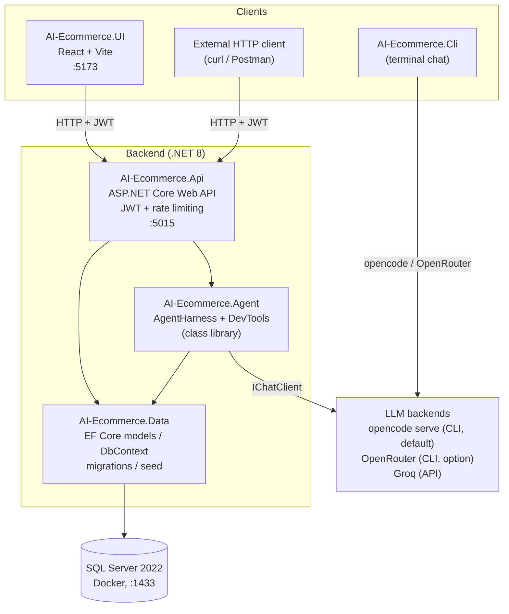
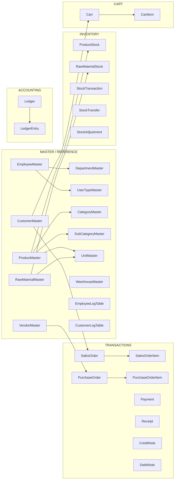

# Agentic Commerce Platform

A full-stack commerce platform with a **built-in AI development agent**.
It started as a simple e-commerce app and has grown into a full
master/transaction/inventory/accounting system with a storefront, an employee
dashboard, and an embedded coding agent that can read, write, and run shell
commands inside this repository on your behalf.

The same agent "brain" is reachable from three places:

- **CLI** (`AI-Ecommerce.Cli`) — terminal chat, developer-focused
- **Web API** (`AI-Ecommerce.Api`) — `POST /api/agent/chat`, JWT-protected
- **React UI** (`AI-Ecommerce.UI`, `/agent` route) — browser chat

All three share the same `AgentHarness`, which owns the system prompt, tool
registration, retry logic, and SQL Server persistence of conversation history.

---

## 1. What this project actually is

1. **A commerce backend** — customers (`CustomerMaster`), staff
   (`EmployeeMaster`), product catalog with a 3-step approval workflow, cart &
   checkout (COD/UPI, no real payments), sales-order tracking, an employee
   dashboard, and generic CRUD for all master tables.
2. **An embedded coding agent** (`AgentHarness`) that can read/search the
   project's own source, write files, and run commands (`dotnet build`,
   `git status`, migrations, …). Writes/commands are gated behind a pluggable
   approval step and, on the API, restricted to privileged roles. It is a
   lightweight, self-hosted "Copilot" scoped to this one repository.

---

## 2. High-level architecture



### Solution layout

```
AgenticCommercePlatform/
├── src/
│   ├── AI-Ecommerce.Api/       # Web API: controllers, JWT, rate limiting, login audit
│   ├── AI-Ecommerce.Agent/     # AgentHarness + DevTools (class library, no Main)
│   ├── AI-Ecommerce.Cli/       # Console entry point — dotnet run works here
│   ├── AI-Ecommerce.Data/      # EF Core models, DbContext, migrations, seeder
│   └── AI-Ecommerce.UI/        # React 19 + TypeScript + Tailwind + Vite frontend
├── tests/AI-Ecommerce.Tests/   # xUnit project (currently a stub, see FutureScope.md)
├── scripts/                    # import-from-excel.ps1, export-data.ps1, seed-data.sql
├── schema/                     # data.xlsx (source of truth), schema.txt (DDL)
├── docker-compose.yml          # sql-server, api, adminer
└── AI-Ecommerce-Platform.slnx  # solution file — build/restore must target this explicitly
```

---

## 3. Agent request flow

```mermaid
sequenceDiagram
    participant C as Client (CLI / API / UI)
    participant H as AgentHarness
    participant DB as SQL Server<br/>(ConversationHistory)
    participant T as DevTools
    participant L as LLM (Groq / OpenRouter / opencode)

    C->>H: ProcessMessageAsync(userId, message, sessionId, allowWriteTools)
    H->>DB: Load history for sessionId (≤ 20 msgs; seed system prompt if empty)
    H->>DB: Persist user message
    H->>L: Chat completion + tools (ToolMode = Auto)
    loop tool calls (with 2x retry on tool_use_failed)
        L-->>H: function-call JSON
        H->>T: ReadFile / ListDirectory / SearchCode<br/>(always allowed)
        H->>T: WriteFile / ExecuteCommand<br/>(only if allowWriteTools && approved)
        T-->>H: tool result
    end
    L-->>H: final text response
    H->>DB: Persist assistant message
    H-->>C: response text
```

### Tool gating by surface

| Surface | Read-only tools | Write / Execute tools | Approval gate |
|---|---|---|---|
| **CLI** (opencode) | n/a — the opencode server runs its own agent | n/a | managed by opencode server |
| **CLI** (`LLM_PROVIDER=openrouter`) | always | always (`allowWriteTools: true`) | interactive `y/n` prompt |
| **API / UI** | always | only JWT `UserTypeId` 1–2 (MasterAdmin/Admin) | pending-approval gate (`GET/POST /api/agent/approvals`, 10-min auto-deny) |

> The API no longer auto-approves. Each write/exec is parked with a token until
> resolved via `POST /api/agent/approvals/{token}` (MasterAdmin/Admin); pending
> items are listed by `GET /api/agent/approvals`, and the `/agent` chat UI shows
> them in an in-chat panel with Approve/Deny buttons (polls every 5 seconds).
> Unresolved items auto-deny after 10 minutes. The triggering chat request stays
> in-flight until the decision lands.

---

## 4. Data model



- `ConversationHistory` stores every agent message (`system`/`user`/`assistant`)
  per `SessionId` + `UserId`.
- Legacy `Product`/`Order`/`OrderItem` tables are still present for
  backward compatibility (old `/api/products`, `/api/orders` flow) — the
  catalog/cart/checkout flow now uses `ProductMaster`/`SalesOrder`.
- Soft-delete everywhere: master entities use a global `DeletedAt == null`
  query filter.
- `ProductMaster` carries a **3-step approval** workflow
  (`Approval1At`/`Approval2At`/`Approval3At`); only fully-approved products
  appear in the storefront catalog.

---

## 5. Tech stack

| Layer | Technology |
|---|---|
| Runtime | .NET 8 (`net8.0`), built/run with .NET SDK 10 (backward compatible) |
| API | ASP.NET Core Web API, JWT bearer auth, ASP.NET Core rate limiting |
| Data | Entity Framework Core 9.0.0 (all projects aligned), SQL Server (Docker or LocalDB) |
| AI | Microsoft.Extensions.AI 10.9.0 + `Microsoft.Extensions.AI.OpenAI` 10.8.0 over an OpenAI-compatible client (`OpenAI` SDK 2.12.0) |
| LLM providers | **API**: Groq (model from `GROQ_MODEL`, default `openai/gpt-oss-20b`); **CLI**: `opencode` server (default) or OpenRouter (`openrouter/free`) via `LLM_PROVIDER` |
| Frontend | React 19, TypeScript, Tailwind CSS, Vite, react-router-dom, axios |
| Infra | Docker Compose (`sql-server`, `api`, `adminer`), Swagger UI |

> All `Microsoft.EntityFrameworkCore.*` packages are pinned to **9.0.0**
> across every project — do not reintroduce a version mismatch (see the rule in
> `AGENTS.md`, section 2).

---

## 6. Project breakdown

### `AI-Ecommerce.Data`
`ApplicationDbContext` (all entities + global soft-delete filters), models for
masters / transactions / inventory / accounting / cart, migrations (incl. a
design-time `ApplicationDbContextFactory` for `dotnet ef`), `DataSeeder`
(presence check against `schema/data.xlsx` data), `PasswordHasher` (PBKDF2).

### `AI-Ecommerce.Agent` (class library — `dotnet run` does NOT work here)
- `Harness/AgentHarness.cs` — system prompt, tool registration, retry on
  `tool_use_failed`, history load/save per `SessionId` (capped at 20 msgs),
  `allowWriteTools` flag.
- `Harness/MockChatClient.cs` — no-op fallback when no LLM key is set.
- `Tools/DevTools.cs` — `ReadFile` / `ListDirectory` / `SearchCode` (always
  available) and `WriteFile` / `ExecuteCommand` (gated behind the static
  `DevTools.ApprovalHandler`). Root resolution walks up to the nearest
  `.slnx`/`.sln`, so tool paths work regardless of the launching process.

### `AI-Ecommerce.Cli`
- **`opencode` (default)**: talks to a running `opencode serve --port 4096`
  HTTP server via `OpenCodeClient`; resumes the last session
  (`.opencode-session` file next to the output assembly).
- **`openrouter`**: routes through `IChatClient` → `AgentHarness` → SQL
  history, with an interactive `y/n` approval prompt.

### `AI-Ecommerce.Api`
- JWT: secret from `JWT_SECRET` env/`.env` (validated `32+` chars at startup,
  never committed), claims `sub`/NameIdentifier (long account id),
  `email`, `AccountType` (`Customer`|`Employee`), `UserTypeId`
  (employees only), 24h expiry. One login endpoint resolves
  CustomerMaster first, then EmployeeMaster.
- Rate limiting: `/api/auth` **5/min per IP**; `/api/agent/chat`
  **10/min per user** (429 when exceeded).
- Login audit: every successful login writes a `CustomerLogTable` /
  `EmployeeLogTable` row (browser/OS parsed from the User-Agent).
- CORS: hardcoded to `http://localhost:5173` (keep in sync with Vite).
- Startup: `DataSeeder.SeedAsync` checks the DB and prints a warning listing
  tables that still need `scripts/import-from-excel.ps1`.

### `AI-Ecommerce.UI`
React + Vite SPA. Pages: home, login/register, employee register,
products (catalog), cart, order tracking, profile, employee dashboard,
master-data CRUD (`/masters/:entity`), agent chat. `src/api/client.ts`
wraps axios (base URL `http://localhost:5015/api`, Bearer token from
`localStorage`) and unwraps ASP.NET `ReferenceHandler.Preserve` (`$id/$values`)
payloads.

---

## 7. API surface (main endpoints)

| Method | Route | Access |
|---|---|---|
| POST | `/api/auth/register` | public — creates a **customer** |
| POST | `/api/auth/register-employee` | MasterAdmin/Admin (`UserTypeId` 1–2) only |
| POST | `/api/auth/login` | public — Customer or Employee |
| POST | `/api/auth/refresh` | public — exchanges a valid refresh token for a fresh JWT (rotates it) |
| POST | `/api/auth/revoke` | authenticated — revokes a refresh token at logout |
| GET | `/api/catalog` | any authenticated user — approved + in-stock products |
| GET/POST | `/api/cart`, `/api/cart/items`, PUT/DELETE `/api/cart/items/{id}`, DELETE `/api/cart` | **customer** |
| POST | `/api/cart/checkout` | customer — cart → SalesOrder + Payment + stock deduction |
| GET | `/api/sales-orders` / `/api/sales-orders/all` / `{id}` | customer (own) / employee (all) |
| PATCH | `/api/sales-orders/{id}/status` | employee (Placed → Processing → Shipped → Delivered / Cancelled) |
| GET | `/api/dashboard/summary` | employee (counts, order-by-status, recent orders, low stock, pending approvals) |
| GET/PUT | `/api/profile` | customer |
| CRUD | `/api/{product, category, subcategory, unit, warehouse, vendor, rawmaterial, department, usertype}-master` | read: authenticated; write: employee |
| CRUD | `/api/customer-master` | read: authenticated; write: employee |
| CRUD | `/api/employee-master` | MasterAdmin/Admin (privilege rules enforced) |
| POST | `/api/agent/chat` | **employee only**; write tools for `UserTypeId` 1–2 |
| GET | `/api/agent/approvals` | employee — list pending agent write/exec approvals |
| POST | `/api/agent/approvals/{token}` | MasterAdmin/Admin — approve/deny a pending operation |
| GET | `/api/audit/employee-logs` / `/api/audit/customer-logs` | employee — recent login audit |
| GET/POST/PUT/DELETE | `/api/products`, `/api/orders` | **legacy** flow, still works |
| — | `/swagger` | development only |

> List endpoints (`/api/products`, `/api/orders`, `/api/catalog`,
> `/api/sales-orders`, `/api/audit/*-logs`) support **optional** pagination via
> `?page=1&pageSize=50` — you get `{ items, page, pageSize, total, totalPages }`;
> omit the params and you get a plain array (backward compatible).

---

## 8. Getting started

Full step-by-step guide (clone, `.env` secrets, DB, three terminals, git
workflow): **`HowtoRunProject.md`**.

```bash
# 1. Clone + secrets
git clone https://github.com/bhakti857/AgenticCommercePlatform.git
cd AgenticCommercePlatform
# copy .env from the private my-secrets repo (or Copy-Item .env.example .env and fill)

# 2. Start SQL Server + apply migrations + import Excel seed data
docker-compose up -d sql-server
cd src/AI-Ecommerce.Data
dotnet ef database update --startup-project ..\AI-Ecommerce.Cli
cd ..\..
$env:SQL_SA_PASSWORD = 'YourStrong!Passw0rd'
.\scripts\import-from-excel.ps1

# 3a. CLI agent (default = opencode; start the server first)
opencode serve --port 4096
cd src\AI-Ecommerce.Cli && dotnet run

# 3b. ...or full web stack (three terminals)
#     Terminal 1: docker-compose up -d sql-server
#     Terminal 2: cd src\AI-Ecommerce.Api && dotnet run        (port 5015)
#     Terminal 3: cd src\AI-Ecommerce.UI && npm install && npm run dev  (port 5173)
```

Build everything from the root (must target the `.slnx` explicitly):

```bash
dotnet build AI-Ecommerce-Platform.slnx
dotnet test  AI-Ecommerce-Platform.slnx
```

---

## 9. Security notes

- `.env` is git-ignored and never committed — secrets live in the separate
  `my-secrets` repo and are copied in locally. `.env.example` lists every key.
- Agent `WriteFile`/`ExecuteCommand` are role-gated on the API (`UserTypeId`
  1–2) **and** gated by the pending-approval workflow: each operation is parked
  with a token until resolved via `POST /api/agent/approvals/{token}`
  (`MasterAdminOrAdmin` policy), with a 10-minute auto-deny (see
  `FutureScope.md` → Security).
- Customers are **rejected outright** from `/api/agent/chat`.
- Password hashing: PBKDF2 via `PasswordHasher`. Never returned by API DTOs.
- JWT secret must be `32+` chars; rotate it if it ever leaks.

---

## 10. Known gaps & roadmap

- Agent write/exec approvals have an **in-chat panel** (`/agent`): pending
  operations poll every 5 seconds with Approve/Deny buttons.
- Conversation **resume across browser reloads** works: the UI persists the
  `SessionId` to `localStorage` and offers a "Start a new conversation" reset.
- Groq → OpenRouter **automatic fallback** is built in (`FallbackChatClient`
  on HTTP 429/404) when `OPENROUTER_API_KEY` is set.
- JWT sessions self-renew via **refresh tokens** (issued at login/register,
  rotated at `POST /api/auth/refresh`, revoked at logout).
- Test project has no real coverage yet.

See **`FutureScope.md`** for the full prioritized backlog and
**`AGENTS.md`** for contributor-facing notes (path resolution, provider
quirks, approval gating, coding standards).

---

## Supporting docs

| File | Purpose |
|---|---|
| `HowtoRunProject.md` | End-to-end setup, running, DB seed/export, git workflow, troubleshooting |
| `FutureScope.md` | Prioritized backlog: security, bugs, features, testing, infra |
| `AGENTS.md` | Guidance for AI coding assistants working in this repo |
| `src/AI-Ecommerce.UI/README.md` | Frontend-specific notes |