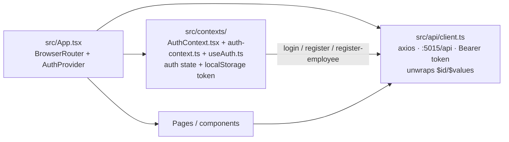

# AI-Ecommerce.UI — React Storefront + Admin

The frontend for the Agentic Commerce Platform. React 19 + TypeScript +
Tailwind CSS + Vite. Talks to `AI-Ecommerce.Api` over HTTP with a JWT.

## Stack

- **React 19** + `react-router-dom` (v7, `BrowserRouter`)
- **TypeScript** (~6.0), **Vite** (v8), **Oxlint** (not ESLint)
- **Tailwind CSS** v3 + `@tailwindcss/forms`
- **axios** for API calls

## Quick start

```bash
npm install
npm run dev          # http://localhost:5173
```

Other scripts:

```bash
npm run build        # tsc -b && vite build
npm run lint         # oxlint
npm run preview      # vite preview
```

The dev server proxies nothing — the SPA calls the API directly. The API must
be running at `http://localhost:5015` and its CORS policy must allow
`http://localhost:5173` (it is hardcoded to that origin in
`src/AI-Ecommerce.Api/Program.cs`).

## How the app is wired



### API client (`src/api/client.ts`)

- Base URL: `http://localhost:5015/api` (change the port here if the API runs
  elsewhere).
- Adds `Authorization: Bearer <token>` from `localStorage` on every request.
- Response interceptor recursively **unwraps ASP.NET
  `ReferenceHandler.Preserve` output** — arrays arrive as
  `{ "$id": "1", "$values": [...] }` and back-references as
  `{ "$ref": "n" }`; the interceptor flattens both so components can treat
  `response.data` as plain arrays/objects. Keep this when touching the client.

### Auth (`src/contexts/`)

Auth is split across three files so each one is Fast Refresh-clean (oxlint's
`react/only-export-components` warns when a single file exports both components
and context objects/hooks):

- `AuthContext.tsx` — exports **only** the `AuthProvider` component; stores
  `token` + user info in `localStorage`.
- `auth-context.ts` — the `AuthContext` object (`createContext`) and the
  `AuthContextType` interface.
- `useAuth.ts` — the `useAuth()` hook; import it from here, never from
  `AuthContext.tsx`.

The provider exposes `login`, `register` (customers), `registerEmployee`
(requires a MasterAdmin/Admin session), and `logout`.

## Routes (`src/App.tsx`)

| Route | Page | Access |
|---|---|---|
| `/` | Home / feature landing | authenticated |
| `/login`, `/register` | Customer login / self-registration | public |
| `/employeeregister` | Create staff accounts | authenticated (server enforces MasterAdmin/Admin) |
| `/products` | Storefront catalog (approved, in-stock products) | authenticated |
| `/cart` | Cart + checkout (COD/UPI) | customer |
| `/orders` | Order tracking (own orders; employee sees status) | authenticated |
| `/profile` | Edit customer profile | customer |
| `/dashboard` | Employee dashboard (counts, low stock, pending approvals) | employee |
| `/masters/:entity` | Master-data CRUD (driven by `src/config/masterConfigs.ts`) | authenticated (writes require employee) |
| `/agent` | AI agent chat | **employee only** (customers get 403 from the API) |

## Master data consumer

`src/config/masterConfigs.ts` is the single source of truth for the generic
master CRUD screens (`src/components/Masters/MasterPage.tsx`): it maps each
master entity key to its endpoint, id field, and column/form field list
(supported field types: `text`, `number`, `select`, `checkbox`, `textarea`,
`password`, plus `optionSource` to lazily load select options from another
master endpoint). Add a new master by adding a config entry + list key.

## Notes

- The agent chat (`src/components/Agent/Chat.tsx`) persists the API-returned
  `SessionId` to `localStorage` (key `agentSessionId`), so a conversation
  resumes across page reloads; a "Start a new conversation" button clears it.
  The same screen polls `/api/agent/approvals` every 5 seconds and offers
  Approve/Deny buttons for pending agent write/exec operations.
- `auth/login` and `auth/register` return a `refreshToken` that `api/client.ts`
  uses to silently renew the JWT when a request 401s (single refresh attempt,
  then the session is cleared) — users are not force-logged-out at the 24h JWT
  boundary. Audit logins are viewable on the `/audit` page (employees only).
- Tooling is modern-Vite (rolldown-based). Lint with `npm run lint` (oxlint),
  not an ESLint config.